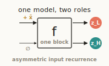
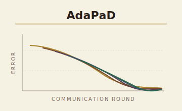
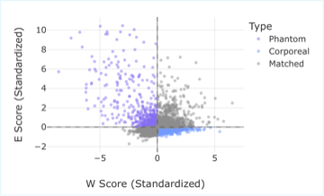
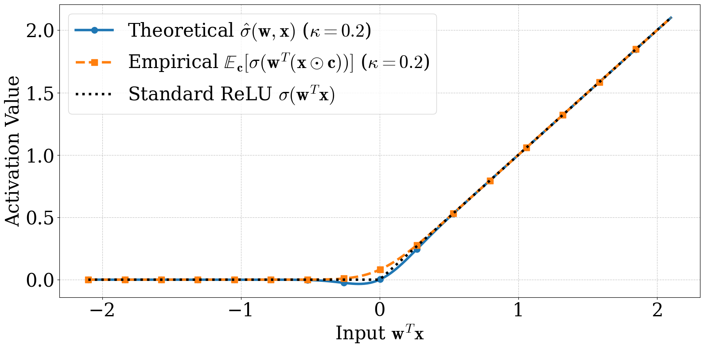

### Blogposts

<ul class="blog-list">

  <li>
    
      
    
    
      <a href="./asymmetric_input.html">One Model, Two Roles: Emergent Specialization in a Shared Recurrent Transformer</a>
      A minimal architectural asymmetry — the input enters one update but not the other — is enough to make a shared-weight recurrent Transformer behave like two. Matches the two-network HRM baseline with half the parameters on Sudoku-Extreme (60.0% vs 55.0%) and Maze-30&times;30 (75.6% vs 74.5%). <a href="https://arxiv.org/abs/2605.17811">arXiv:2605.17811</a>.
      With <a href="https://juchengshen.github.io/">Jucheng Shen</a> and <a href="https://www.linkedin.com/in/barbara-su-966314268/">Barbara Su</a> (Rice CS).
    
  </li>

  <li>
    
      
    
    
      <a href="./adapad.html">From PCA to LoRA: Why Fine-Tuning Could Have Been Parallel All Along</a>
      A 1933 deflation convention let rank-1 errors compound in LoRA fine-tuning. AdaPaD does it in parallel — and the errors correct themselves, provably. Best GLUE average (89.34) at matched 0.34M parameter budget; 3.62× per-batch speedup on 4 H200 GPUs. <a href="https://arxiv.org/abs/2605.10741">arXiv:2605.10741</a>.
      With <a href="https://github.com/barbara-su">Barbara Su</a>, <a href="https://jasperliao.github.io/">Fangshuo (Jasper) Liao</a> (Rice CS).
    
  </li>

  <li>
    
      
    
    
      <a href="./ghost_mamba2.html">GHOST: pruning Mamba2 by what each channel does</a>
      A forward-only state pruner for Mamba2 selective SSMs — controllability × observability, two forward passes, ~15 GB peak VRAM. ICML 2026.
      With <a href="https://github.com/Menezmic21">Michael Menezes</a> (Rice CS).
    
  </li>

  <li>
    
      
    
    
      <a href="./multiplicative_gaussian_input.html">How a little Gaussian dust changes how a network learns</a>
      Multiply every input by random noise. Training still converges — to a target whose distance from the global minimum we can write down.
      With Afroditi Kolomvaki, <a href="https://jasperliao.github.io/">Fangshuo (Jasper) Liao</a>, Evan Dramko, Ziyun Guang (Rice CS).
    
  </li>

  <li>
    
      
    
    
      <a href="./stochastic_self_stabilization.html">Why Stochastic Gradient Descent Stops Just Short of the Edge</a>
      A closed-form sharpness gap explains a long-observed property of mini-batch training.
      With <a href="https://jasperliao.github.io/">Fangshuo (Jasper) Liao</a>, Afroditi Kolomvaki (Rice CS).
    
  </li>

  <li>
    
      
    
    
      <a href="./accelerated_nesterov_deepReLU.html">Provable Acceleration of Nesterov's Momentum for Deep ReLU Networks</a>
      A new objective class that makes Nesterov provably accelerated for non-trivial neural architectures.
      With <a href="https://jasperliao.github.io/">Fangshuo (Jasper) Liao</a> (Rice CS).
    
  </li>

  <li>
    
      
    
    
      <a href="./parallel_deflation.html">Provable Model-Parallel Distributed Principal Component Analysis with Parallel Deflation</a>
      A self-correcting parallel deflation scheme for distributed PCA, with convergence guarantees.
      With <a href="https://jasperliao.github.io/">Fangshuo (Jasper) Liao</a>, Wenyi Su (Rice CS).
    
  </li>

</ul>
