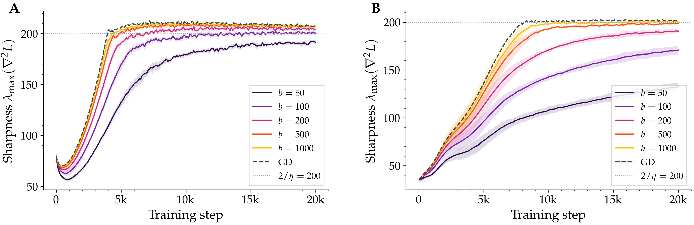
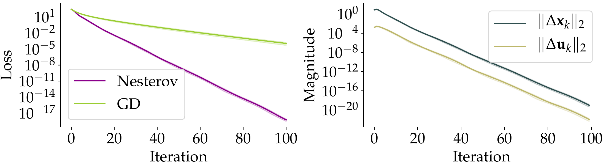
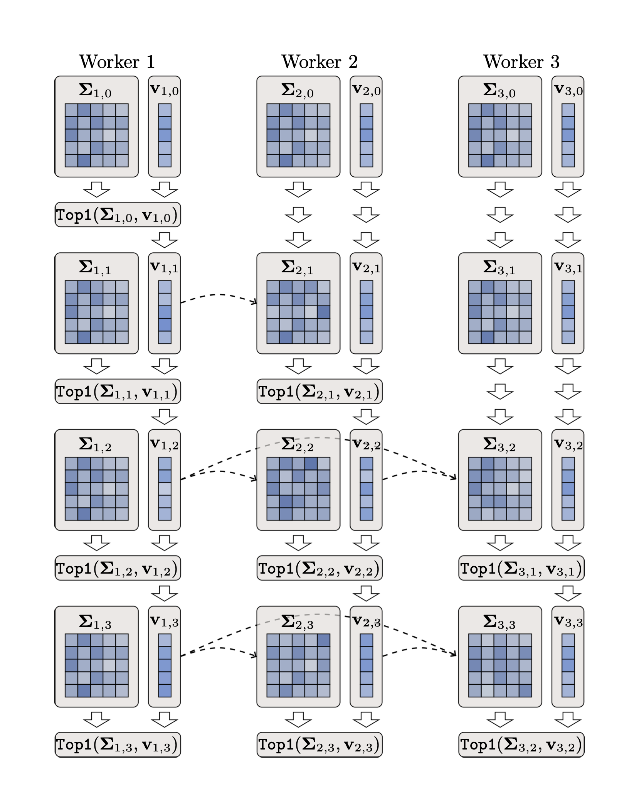

### Blogposts

<ul class="blog-list">

  <li>
    
      
    
    
      <a href="./stochastic_self_stabilization.html">Why Stochastic Gradient Descent Stops Just Short of the Edge</a>
      A closed-form sharpness gap explains a long-observed property of mini-batch training.
    
  </li>

  <li>
    
      
    
    
      <a href="./accelerated_nesterov_deepReLU.html">Provable Acceleration of Nesterov's Momentum for Deep ReLU Networks</a>
      A new objective class that makes Nesterov provably accelerated for non-trivial neural architectures.
    
  </li>

  <li>
    
      
    
    
      <a href="./parallel_deflation.html">Provable Model-Parallel Distributed Principal Component Analysis with Parallel Deflation</a>
      A self-correcting parallel deflation scheme for distributed PCA, with convergence guarantees.
    
  </li>

</ul>
